# Card

Card allows you to measure trends through key performance indicators (KPIs) like Value and Goal. 

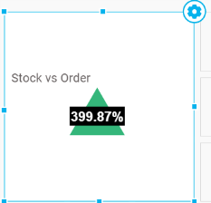

## How to configure flat table data to Card Widget?

To showcase a card, a minimum requirement of 1 actual and/or target value is needed.

The following procedure illustrates data configuration of Card.

Drag and drop `Card` control icon from the Tool box into design panel. You can find control in Toolbox by search.

After control added in design panel, click `Assign Data` button at Design Tools Pane to open the Data configuration pane.

Bind column through drag and drop element from `Measures` section to `Actual Value`.

Drag and Drop the elements to `Target Value`.

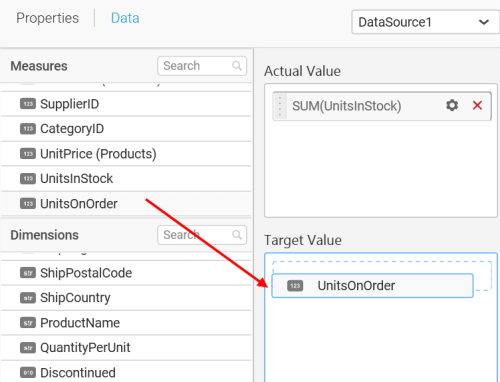

You can use aggregate function to change the `Actual Value` of the card.

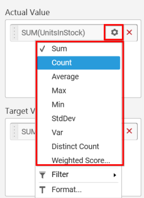

You can use `Filter` option to filter the data by specifying the filter condition.

`Measure Filter` window will be shown to set the `Ranges`.

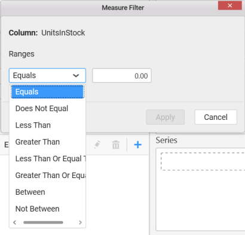

You can clear filter by selecting the `Clear` option for `Actual Value`.

You can the change the `Target value` by selecting aggregate function.

You can use `Filter` option to filter the data by specifying the filter condition.

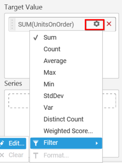

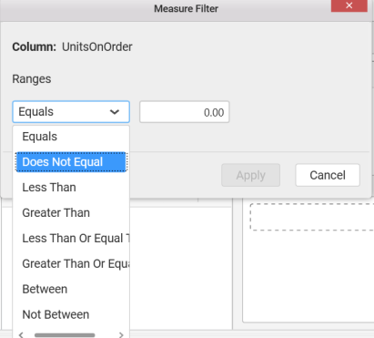

You can clear filter by selecting the `Clear` option for `Target Value`.

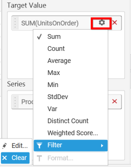

Drag and Drop the elements from sections to Series.

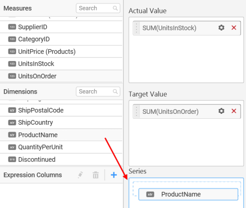

You can change the Series value of the card by changing the setting.

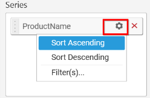

You can use the filters by selecting the `Filter(s)…` option to rank the elements.

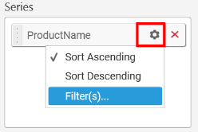

You can select the specific country to filter the element and `CheckAll` is used either to check all the data or to select the specific data. `Include` and `Exclude` is used to include and exclude the elements by selecting the radio button and click the `Apply` button.

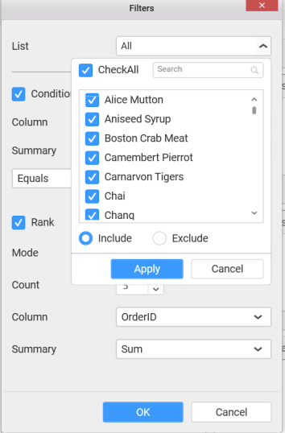

You can select the `Condition` option to change the `Column` elements and `Summary type` by selecting required column name and summary type. 

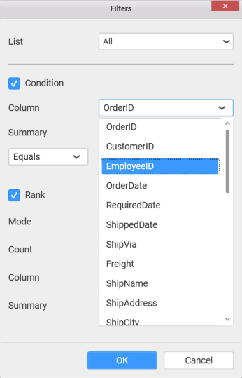

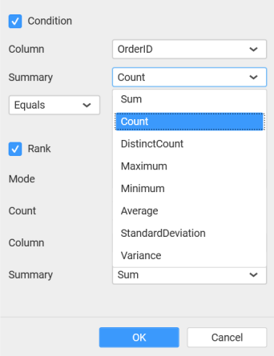

You can select the `Rank` option to enable filters and select the `Mode` either top or bottom.

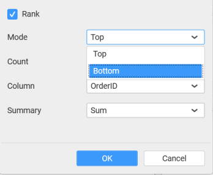

You can change the `Count` value to filter the top elements and change the column and summary type as required and click `OK` button.

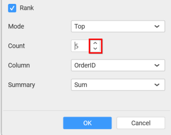

You can clear filter by selecting `Show All Records` for `Series` section.

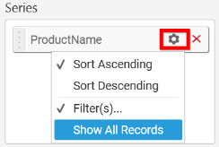

Here is an illustration,

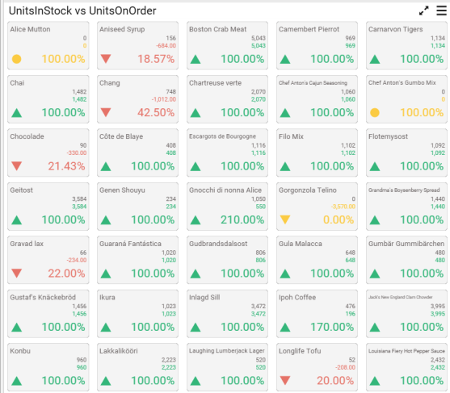

## How to configure SSAS data to Card Widget?

To showcase a card, a minimum requirement of 1 actual and/or target value is needed.

Following steps illustrates configuration of SSAS data to Card.

Drag and drop `Card` control icon from the Tool box into design panel. You can find control in Toolbox by search.

 
After control added in design panel, click `Assign Data` button at Design Tools Pane to open the Data configuration pane.

 
Drag and drop a column under `Measures` category into `Actual Value`.

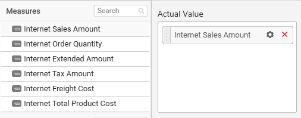
 
Drag and drop a column under `Measures` category into `Target Value`.

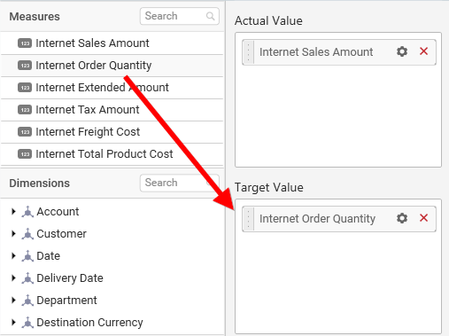
 
Define the filter criteria to match through choosing `Edit` option in `Filter` menu item.

 
The `Measure filter` dialog will be shown where you can choose the filter condition and apply the condition value.

 
Select `Clear` option to clear the defined filter.
 

Select `Format` option to define the display format to the values in the column through `Measure Formatting` window.

 

Choose the options you need and click `OK`.

 
Add a dimension level or hierarchy into `Series` section through drag and drop.
 
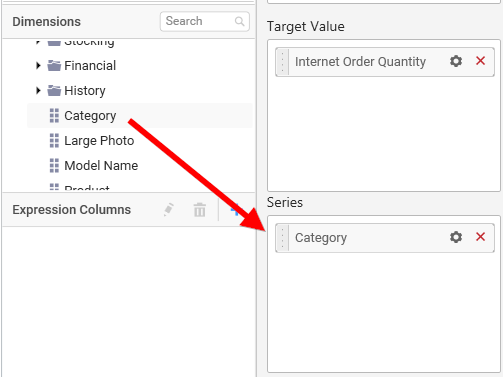

Define filter criteria through `Filter(s)…` menu item in the `Settings` drop down menu.
 
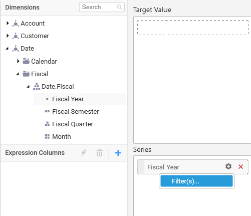

To know more about filters, refer [here](/dashboard-platform/dashboard-designer/compose-dashboard/configuring-widget-filters).

Here is an illustration,
 
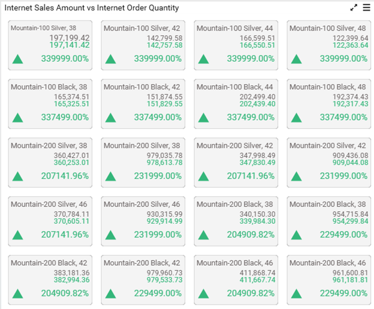

## How to format Card Widget?

You can format the card for better illustration of the view that you require, through the settings available in `Properties` pane.

**General Settings**

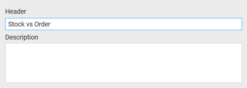

**Header**

This allows you to set title for this card widget.

**Description**

This allows you to set description for this card widget, whose visibility will be denoted by `i` icon, hovering which will display this description in tooltip.

**Basic Settings**

**Title**

You can set a custom name as card title.

**Title Alignment**

The title can be aligned left, center, or right.

**Title Color**

The color of title text can be customized.

**Subtitle**

A sub title can be added to the card control providing a suitable text. Subtitle text will be displayed at the bottom of the title text.

**Subtitle Foreground**

The text color of subtitle text can be customized.

**Value Alignment**

You can customize the text alignment. This option will be disabled when `Show Indicator Only` option was enabled.

**Actual Value Foreground**

You can customize the color of card value. This option will be disabled when `Show Indicator Only` option was enabled.

**Secondary Value Type**

This allows you to set the Secondary Value Type based on the Variation and Target Value.

**Actual Value Prefix**

This allows you to set the actual value prefix.

**Target Value Prefix**

This allows you to set the target value prefix.

**Behavior Settings**

**High Value is Good**

The card visualization can be customized through specifying whether higher value should be treated as good or bad.

**Show Indicator Only**

Enabling this allows you to show indicator representation alone in card. This option will be available only if columns are added to both `Actual Value` and `Target Value` sections.

**Variation Type**

This allows you to customize the data showcased in card control by switching the Variation types to either Absolute, Percent of Target, or Percent of Difference.

**Filter Settings**

**Act as Master**

This allows you to define this grid widget as a master widget such that its filter action can be made to listen by other widgets in the dashboard.

**Ignore Filter Actions**

This allows you to define this grid widget to ignore responding to the filter actions applied on other widgets in dashboard.

**Link Settings**

You can enable linking and configure to navigate either to a published dashboard URL or to a general URL with or without parameters. For more details, refer [Linking](/dashboard-platform/dashboard-designer/compose-dashboard/linking-urls-and-dashboards). 

**Container Appearance**

**Title Alignment**

This allows you to handle the alignment of widget title to either left, center or right.

**Title Color**

This allows you to apply text color to the widget title.

**Show Border**

This allows you to toggle the visibility of border surrounding the widget.

**Corner Radius**

This allows you to apply the specified radius to the widget corners. Value can be between 0 and 10.

**Show Maximize**

This allows you to enable/disable the maximized mode of this card widget. The visibility of the maximize icon in widget header will be defined based on this setting. Clicking this icon in viewer will show the maximized view of the grid widget.

**CSV Export**

This allows you to enable/disable the CSV export option for this card widget. Enabling this allows you to export the summarized data of the widget view to CSV format.

**Excel Export**

This allows you to enable/disable the Excel export option for this card widget. Enabling this allows you to export the summarized data of the widget view to XLSX format.

**Image Export**

This allows you to enable/disable the image export option for this card widget. Enabling this allows you to export the view of the widget to image format (*.JPG) in viewer.

**Enable Comment**

This allows you to enable/disable comment for dashboard widget. For more details refer [here](/dashboard-platform/dashboard-designer/compose-dashboard/commenting-dashboard-and-widget)

