# Date Picker

Date Picker enables you to filter based on the single or range of date selection. 

## How to configure flat table data to date picker?

Drag and drop the `Date Picker` from toolbox at left into design canvas and resize it to your required size.

Keep the selection focus on the dropped date picker widget.

Click on `Assign Data` button in the tool bar.

Now, the `Data` window will be opened with available date fields in `Dimension` from the connected data source.

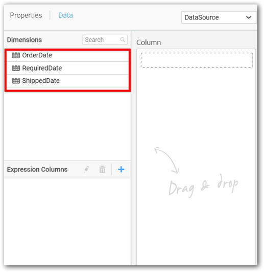

Drag and drop a date field from `Dimensions` into `Column` section.

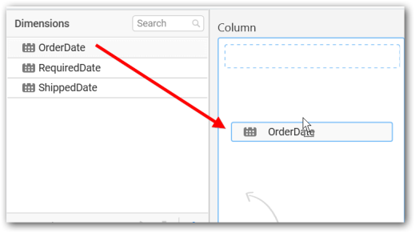

To filter out a specific range of dates, click the `Settings` icon in the dropped column and select `Filter(s)...` in the drop down menu. 

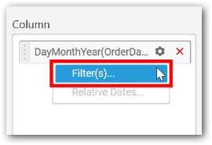

Now the `Range Filter` window get displayed. Configure the date range to be filtered out and click `Apply`.

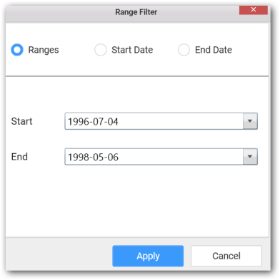

To clear the filter applied, click on `Show All Records` item in the drop down menu.

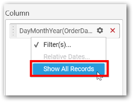

## How to configure the SSAS data to date picker?

Following steps illustrates configuration of SSAS data to `Date Picker`.

Drag and drop the `Date Picker` from toolbox at left into design canvas and resize it to your required size.

Select the dropped widget using mouse.

Click on `Assign Data` button in the tool bar.

A Data pane will be opened with available date `Dimensions`.

Drag and drop a column under `Dimensions` category into `Column`.

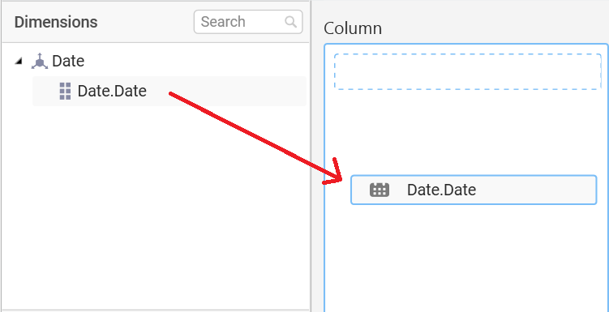

Define filter with specific range of dates by click the Settings icon in the dropped column and select `Filter(s)...` in the drop down menu.

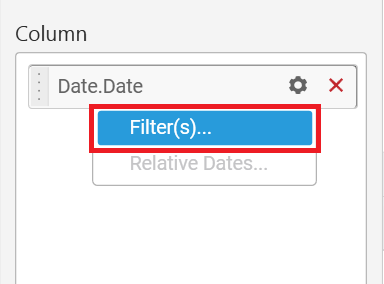

Define the date range in `Range Filter` dialog and click `Apply`.

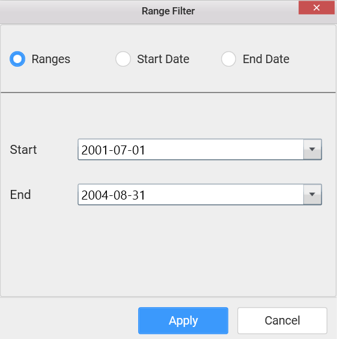

To show all records again click on `Show All Records`.

## How to configure relative dates to date picker?

Switch to the `Properties` pane; Set the `Selection Type` as `Range`; Switch back to `Data` pane; Click the `Settings` icon in the dropped date column and select `Relative Dates...` in the drop down menu. 

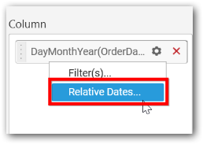

In the launched `Relative Date Options` window, configure the relative date and click `Add`. Repeat the same till the required set of relative dates added.

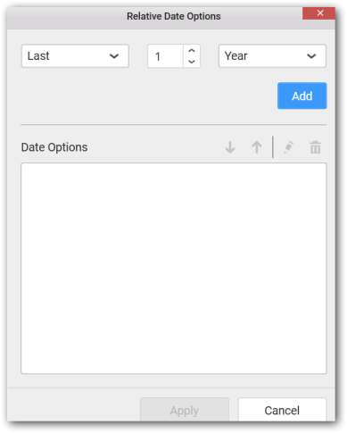

You can see the added relative dates in date picker like below.

## How to format date picker?

Keep the selection focus on the date picker and Click on `Widget Settings` icon.

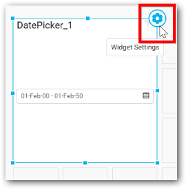

The property window will be opened like below.

You can see the list of properties available for the widget with default value.

**General Settings**

**Header**

This allows you to set title for this Date Picker widget.

**Description**

This allows you to set description for this Date Picker widget, whose visibility will be denoted by `i` icon, hovering which will display this description in tooltip.

**Basic Settings**

**Selection Type**

**Single** – Single date can be bounded.

**Range** – A range of dates (two dates) can be bounded.

**Highlight Available Dates**

This allows you to enable the highlighting of available dates in date picker.

**Filter Settings**

**Act as Master Widget**

This allows you to define this date picker widget as a master widget such that its filter action can be made to listen by other widgets in the dashboard.

**Ignore Filter Actions**

This allows you to define this date picker widget to ignore responding to the filter actions applied on other widgets in dashboard.

**Container Settings**

**Title Alignment**

This allows you to handle the alignment of widget title to either left, center or right.

**Title Color**

This allows you to apply text color to the widget title.

**Show Border**

This allows you to toggle the visibility of border surrounding the widget.

**Corner Radius**

This allows you to apply the specified radius to the widget corners. Value can be between 0 and 10.

**Enable Comment**

This allows you to enable/disable comment for dashboard widget. For more details refer [here](/dashboard-platform/dashboard-designer/compose-dashboard/commenting-dashboard-and-widget)

