# Pivot Grid

Pivot Grid allows you to display summarized data in cross tabular format.

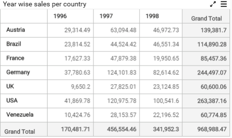

## How to configure flat table data to Pivot Grid?

To construct a pivot grid, a minimum requirement of 1 value and 1 row/column is needed.

The following procedure illustrates data configuration of Pivot Grid.

Drag and drop `Pivot Grid` control icon from the Tool box into design panel. You can find control in Toolbox by search.

After control added in design panel, click `Assign Data` button at Design Tools Pane to open the Data configuration pane.

Drag and Drop the elements from `Measures` to `Value(s)`.

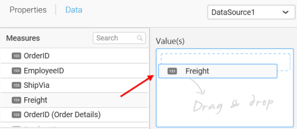

Drag and Drop the elements from sections to `Row(s)`.

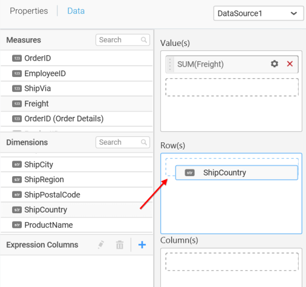

You can use the aggregation function to change the `Value(s)` of the column.

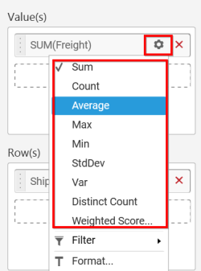

You can use the `Filter` option to enable filters by selecting the `Edit` option.

`Measure Filter` window will be shown to set the `Ranges`.

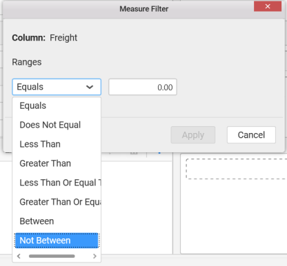

You can clear the filters by selecting the `Clear` option.

You can format the values by selecting the `Format` option.

`Measure Formatting` window will be shown.

Drag and Drop the elements from sections to `Column(s)`.

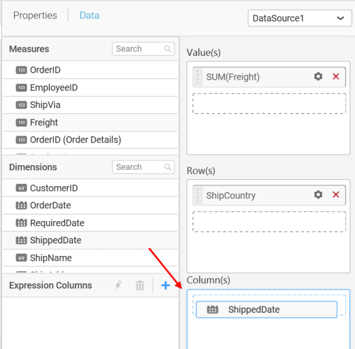

You can select the settings to sort the data either `Ascending` or `Descending`

You can use the filters by selecting the `Filter(s)…` option to rank to the elements.

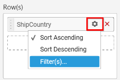

You can select the specific country to filter the element and `CheckAll` is used either to check all the data or to select the specific data. `Include` and `Exclude` is used to include and exclude the elements by selecting the radio button and click the `Apply` button.

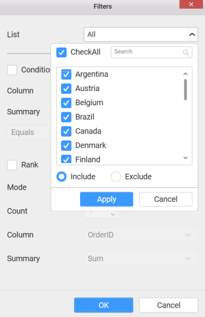

You can select the Condition option to change the `Column` elements and `Summary` type by selecting the required column name and summary type.

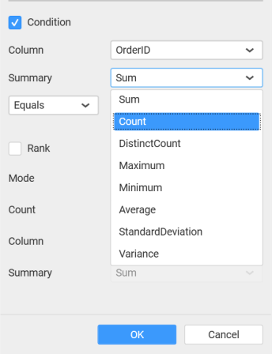

You can select the `Rank` option to enable filters and select the `Mode` either top or bottom.

You can change the `Count` value to filter the top elements and change the column and summary type as required and click `OK` button.

You can clear the filters by selecting the `Show All Records`.  

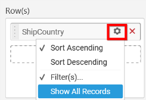

You can sort the values by selecting either `Ascending` or `Descending`. `Filter(s)…` option can be used to edit the filter condition. More option is used to set the Time and Date in different format.

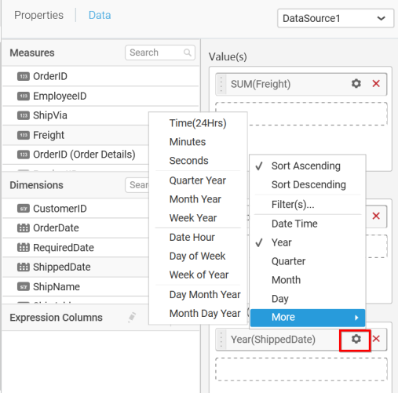

Here is an illustration,

## How to configure the SSAS data to Pivot Grid?

To construct a pivot grid, a minimum requirement of 1 value and 1 row/column is needed.

Following steps illustrates configuration of SSAS data to Pivot Grid.

Drag and drop `Pivot Grid` control icon from the Tool box into design panel. You can find control in Toolbox by search.

 
After control added in design panel, click `Assign Data` button at Design Tools Pane to open the Data configuration pane.

 
Drag and drop a column under `Measures` category into `Value(s)`.

 
Define the filter criteria to match through choosing `Edit` option in `Filter` menu item.

 
The `Measure filter` dialog will be shown where you can choose the filter condition and apply the condition value.

 
Select `Clear` option to clear the defined filter.
 

Select `Format` option to define the display format to the values in the column through `Measure Formatting` window.

 

Choose the options you need and click `OK`.

 
Drag and drop a dimension level or hierarchy element under `Dimensions` category into `Row(s)`.

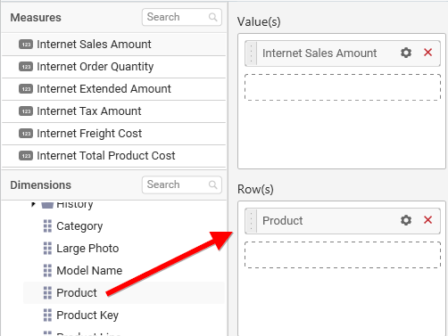 

Drag and drop a dimension level or hierarchy element under `Dimensions` category into `Column(s)`.

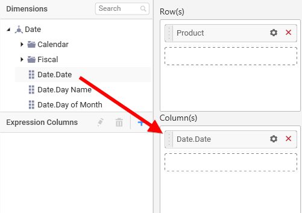 

Define filter criteria through `Filter(s)…` menu item in the `Settings` drop down menu.

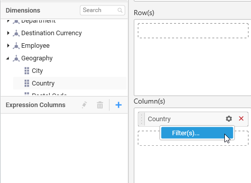
 
To know more about filters, refer [here](/dashboard-platform/dashboard-designer/compose-dashboard/configuring-widget-filters). 

Here is an illustration,
 
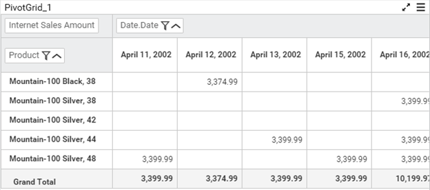

## How to format Pivot Grid?

You can format the Pivot grid for better illustration of the view that you require, through the settings available in Properties pane.

**General Settings**

**Header** 

This allows you to set title for this pivot grid widget.

**Description**

This allows you to set description for this pivot grid widget, whose visibility will be denoted by `i` icon, hovering which will display this description in tooltip.

**Basic Settings**

**Enable GroupingBar**

You can enable/disable the grouping bar which contains in line filtering and sorting option.

**Enable Row Summary**

You can enable/disable the grand total summary row.

**Enable Column Summary**

You can enable/disable the grand total summary column.

**Filter settings**

**Act as Master Widget**

This allows you to define pivot grid widget as a master widget such that its filter action can be made to listen by other widgets in the dashboard.

**Ignore Filter Actions**

This allows you to define this pivot grid widget to ignore responding to the filter actions applied on other widgets in dashboard.

**Enable Hierarchical Filtering**

Through this option, you can enable/disable hierarchical Top `N` filtering. While applying Top N filter with multiple dimension columns, the data returned can be customized based on whether the filtering need to be done as flat or based on the hierarchy of dimension columns added. When `Flat` is set, the least number set as top will be applied for the whole data. When `Hierarchical` is set, the Top N will be applied for each individual column separately based on the number set for each column.

Below example shows data of 3 Country and its 2 Cities where the sales is high.

**Flat Top N**

**Hierarchical Top N**

**Link Settings**

You can enable linking and configure to navigate either to a published dashboard URL or to a general URL with or without parameters. For more details, refer [Linking](/dashboard-platform/dashboard-designer/compose-dashboard/linking-urls-and-dashboards). 

**Container Appearance**

**Title Alignment**

This allows you to handle the alignment of widget title to either left, center or right.

**Title Color**

This allows you to apply text color to the widget title.

**Show Border**

This allows you to toggle the visibility of border surrounding the widget.

**Corner Radius**

This allows you to apply the specified radius to the widget corners. Value can be between 0 and 10.

**Show Maximize**

This allows you to enable/disable the maximized mode of this pivot grid widget. The visibility of the maximize icon in widget header will be defined based on this setting. Clicking this icon in viewer will show the maximized view of the pivot grid widget.

**CSV Export**

This allows you to enable/disable the CSV export option for this pivot grid widget. Enabling this allows you to export the summarized data of the widget view to CSV format.

**Excel Export**

This allows you to enable/disable the Excel export option for this pivot grid widget. Enabling this allows you to export the summarized data of the widget view to XLSX format.

**Image Export**

This allows you to enable/disable the image export option for this pivot grid widget. Enabling this allows you to export the view of the widget to image format (*.JPG) in viewer.

**Enable Comment**

This allows you to enable/disable comment for dashboard widget. For more details refer [here](/dashboard-platform/dashboard-designer/compose-dashboard/commenting-dashboard-and-widget)

