# Radio Button

Radio Button allows you to filter based on single items selection in a group. To configure a radio button, a minimum requirement of 1 column is needed.

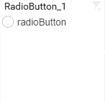

## How to configure the flat table data to Radio Button?

The following procedure illustrates data configuration of Radio Button.

Drag and drop `Radio Button` control icon from the Tool box into design panel. You can find control in Toolbox by search.

After control added in design panel, click `Assign Data` button at Design Tools Pane to open the Data configuration pane.

Bind column through drag and drop element from sections to `Column` section.

You can select the settings to sort the data either `Ascending` or `Descending`.

You can use the filters by selecting the `Filter(s)…` option to rank the elements.

You can select the specific city to filter the element and `CheckAll` is used either to check all the data or to select the specific data. `Include` and `Exclude` is used to include and exclude the elements by selecting the radio button and click the `Apply` button.

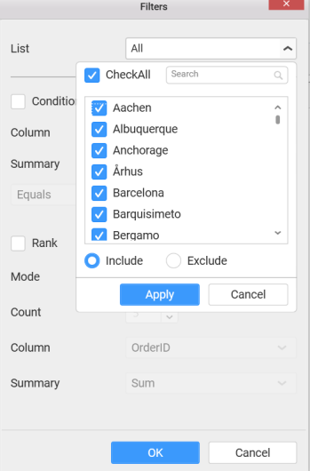

You can select the `Condition` option to change the `Column` elements and *`Summary` type by selecting the required column name and summary type.

You can select the `Rank` option to enable filters and select the `Mode` either top or bottom.

You can change the `Count` value to filter the top elements and change the column and summary type as required and click `OK` button.

You can clear the filters by selecting the `Show All Records` option.

Here is an illustration,

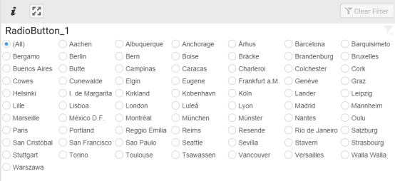

## How to configure the SSAS data to Radio Button?

Following steps illustrates configuration of SSAS data to Radio Button.

Drag and drop the `Radio Button` widget into canvas and resize into your required size.

Select the dropped widget using mouse.

Click the `Assign Data` button in the toolbar.

A Data pane will be opened with available `Dimensions`.

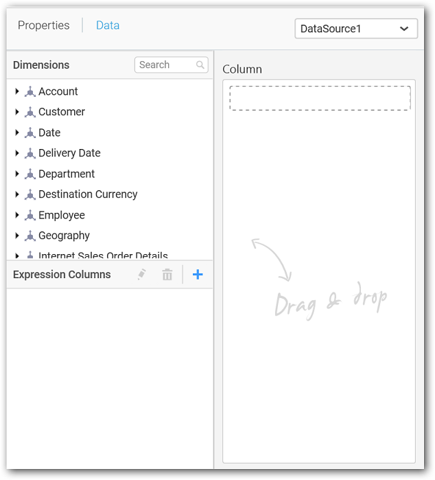

Add a dimension level or hierarchy into `Column(s)` section through drag and drop.

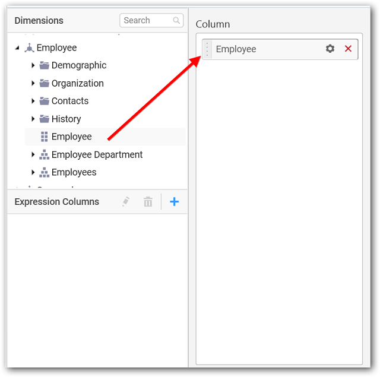

Define filter criteria through `Filter(s)…` menu item in the Settings drop down menu.

Select `Filter(s)…` to launch the `Filters` window.

Define the filter `Condition` and `Rank` and Click `OK`.

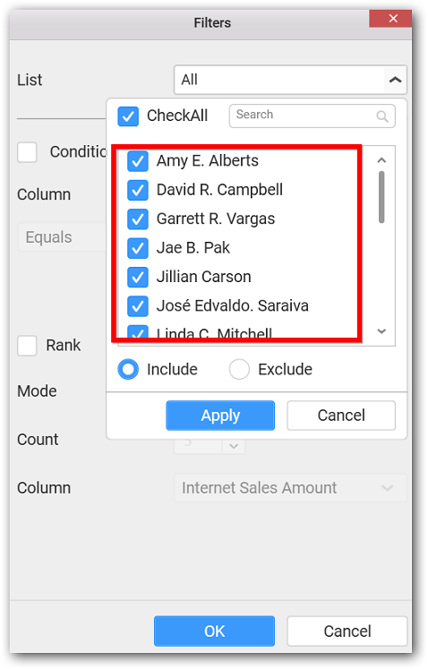

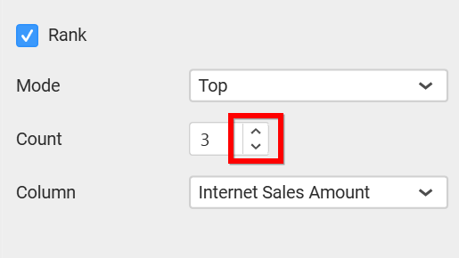

To show all records again click on `Show All Records`.

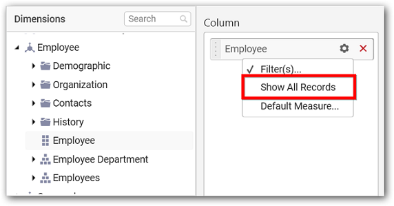

You can add `default measure` to the dropped dimension to retrieve exact result for that dimension.

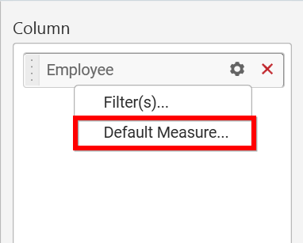

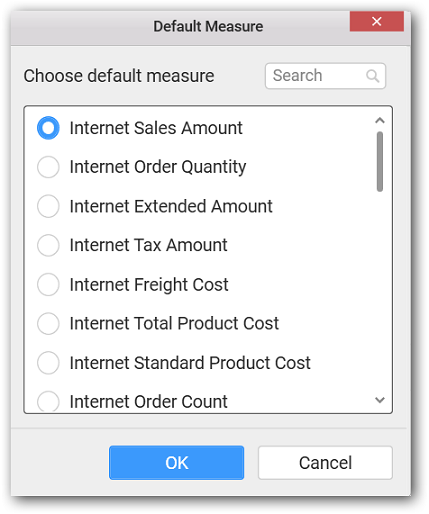

Here is an illustration,

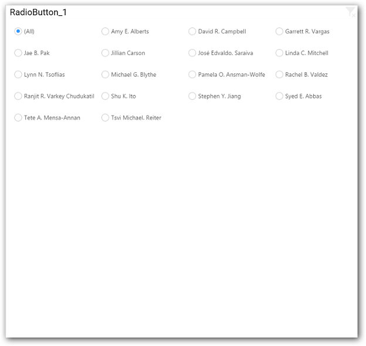

## How to format Radio Button?

You can format the Radio Button for better illustration of the view that you require, through the settings available in `Properties` pane.

**General Settings**

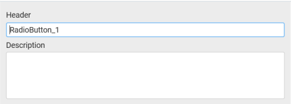

**Header**

This allows you to set title for this radio button widget.

**Description**

This allows you to set description for this radio button widget, whose visibility will be denoted by `i` icon, hovering which will display this description in tooltip.

**Basic Settings**

**Show (All) item**

This allows you to enable selection or deselection of entire items by adding `All` item.

**Radio Button with Show All**

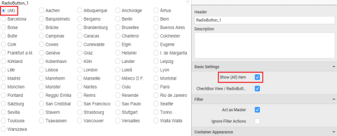

**Radio Button without All**

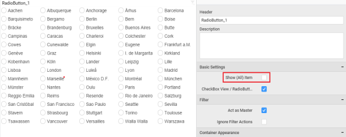

**CheckBox View/RadioButton View**

This allows you to change the view of the widget to checkbox.

**Radio Button as Check Box View**

**Filter Settings**

**Act as Master Widget**

This allows you to define this radio button widget as a master widget such that its filter action can be made to listen by other widgets in the dashboard.

**Ignore Filter Actions**

This allows you to define this radio button widget to ignore responding to the filter actions applied on other widgets in dashboard.

**Container Appearance** 

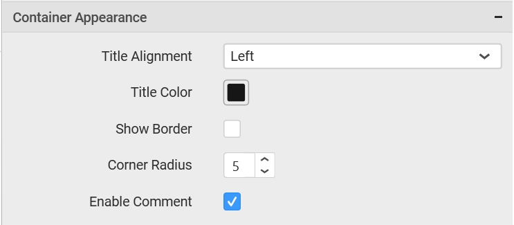

**Title Alignment**

This allows you to handle the alignment of widget title to either left, center or right.

**Title Color**

This allows you to apply text color to the widget title.

**Show Border**

This allows you to toggle the visibility of border surrounding the widget.

**Corner Radius**

This allows you to apply the specified radius to the widget corners. Value can be between 0 and 10.

**Enable Comment**

This allows you to enable/disable comment for dashboard widget. For more details refer [here](/dashboard-platform/dashboard-designer/compose-dashboard/commenting-dashboard-and-widget)

