# Getting Started with Dashboard Designer

This is a simple walkthrough to get you start with Dashboard Designer application. Throughout this walkthrough, the Northwind database is used to demonstrate each of the features in Dashboard Designer.

## Running Dashboard Designer

Launch the Dashboard Designer application through double clicking the shortcut icon in desktop.

You can also launch the Dashboard Designer application from the Apps list.

Now the dashboard designer application opens with the following view:

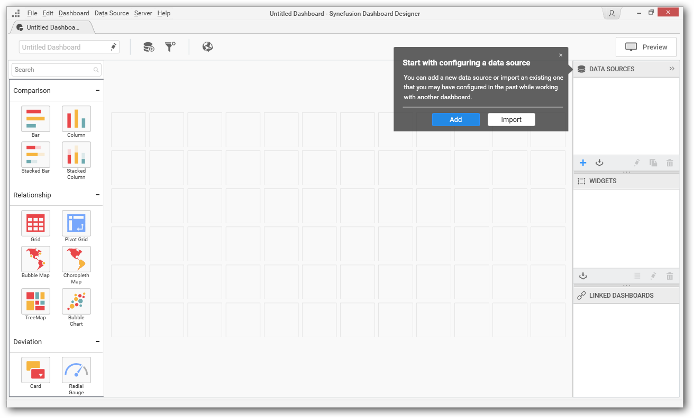

## Connecting to Data

Add a new data source through establishing a data connection with any of the supported data connection types like mentioned below:

### Setting up Connection

Click `Add` button in data source configuration smart screen window to launch a `New Connection` configuration dialog.

## Configuring Tables & Views

In the New Connection configuration dialog, fill the connection type and related details.

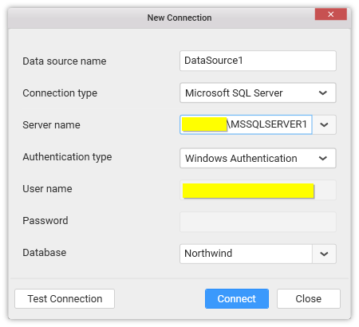

Test the connection for its validity through clicking `Test Connection` button. Following confirmation message will confirm its validity.

Click `OK` button to close the confirmation message and then click `Connect` button in `New Connection` dialog. Now the following view displayed.

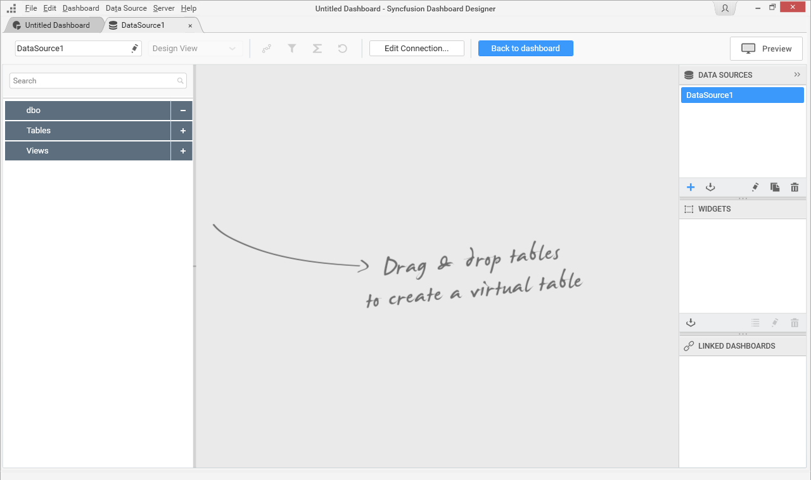

The left pane holds the tables and views associated with the connected database. Drag your preferred table or view from the left pane and drop into the center pane labeled `Drag & drop tables to create a virtual table` like below.

The dropped tables will be remarked by a tick mark before name of both table and its columns in the left pane like below:

The primary key defined in the table in the connected database will be remarked like below:

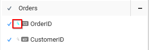

Similarly, the foreign key defined in the table in the connected database will be remarked like below:

The data type of the each column will be represented nearby like below:

Add more than one table, if you prefer, through following same drag `n` drop operation. This is subjected to [joining](/dashboard-platform/dashboard-designer/transforming-data/joining-table) of tables.

## Transforming Data

[Rename](/dashboard-platform/dashboard-designer/transforming-data/formatting-column) the column as required, either through the option exposed in `Settings` drop down menu or double-clicking the column to enable the edit mode.

Remove the column that you don’t require, through clicking the icon at left of the respective column.

The removed column will be represented with the red colored icon like above. Clicking the same, will re-include that column for consideration.

Handle column type conversion, if required, through clicking the `Settings` icon at the respective column and navigate to `Change Column Type` option and select the preferred type to convert to like below:

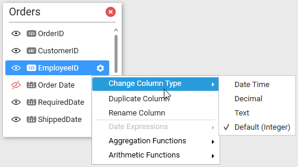

For supported column types and their equivalent convertible types, you can refer [Formatting Columns](/dashboard-platform/dashboard-designer/transforming-data/formatting-column). 

Add [expression columns](/dashboard-platform/dashboard-designer/transforming-data/configuring-expression-columns) that you desire, through creating it using built-in functions and existing columns.

Filter out the data that don’t require to be considered into dashboard through the [data filters](/dashboard-platform/dashboard-designer/transforming-data/configuring-data-filters) option in the tools pane in data design view highlighted below.

## Creating Dashboard

Navigate to the dashboard design view through clicking the `Back to dashboard` button.

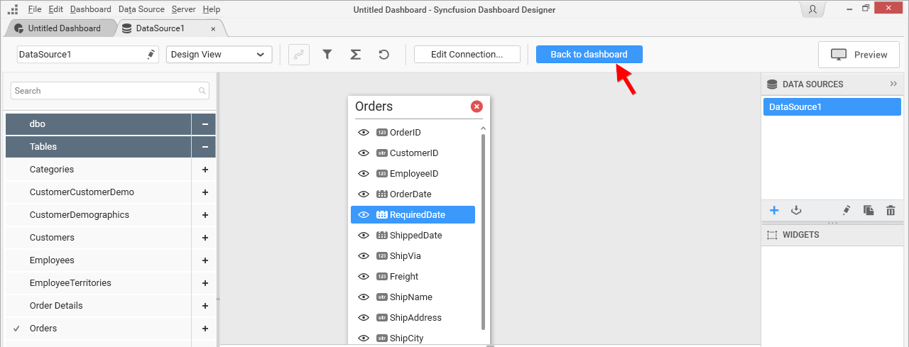

You can also navigate to the dashboard design view through clicking the dashboard tab directly.

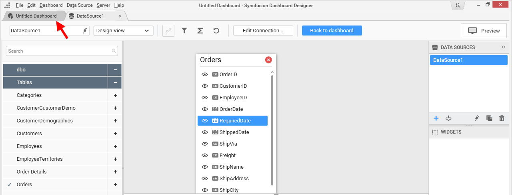

Now, the dashboard designer tab will open like below.

## Adding a Widget to Design View

The toolbox pane at left consist of data visualization, filter and miscellaneous widgets which you can utilize to design an interactive dashboard.

Click and drag your preferable widget from toolbox through pressing the mouse left button and drop into the available space in the design area like below:

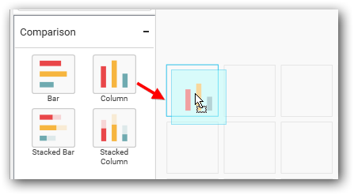

The widget drop will happen only when you drop it in the appropriate region. In the above image, you can observe blue border for the cell when you drag over the respective region, which remarks, the targeted region is valid to drop.

The invalid region will be represented by a red border which will not apply the drop action. This case will happen when you drop over a region where widget or its part exists already like below where pivot grid widget was dragged and dropped over the chart widget.

Once you dropped the widget, you can resize if required like below by placing the focus over the widget and dragging its corner.

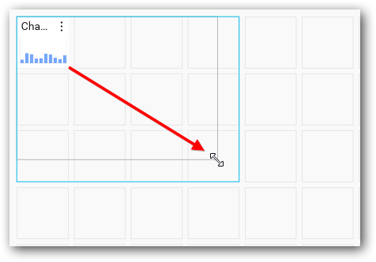

Doing so, will render the widget to the size you dragged. Here, the blue border indicates the cell range which the widget will occupy after resize.

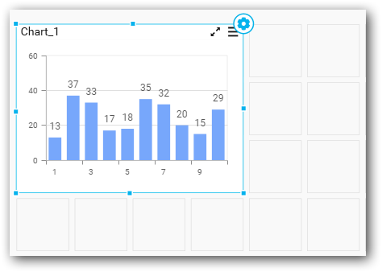

## Assigning Data to Widget

N> This step is applicable only for the widgets other than miscellaneous category.

To bind data to a widget placed in design area, place focus to that widget.

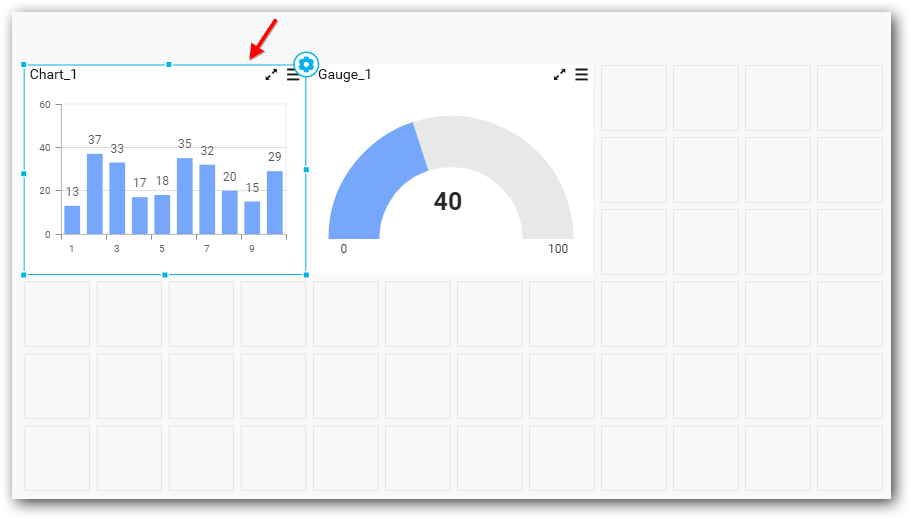

Click `Assign Data` button (highlighted below) in the design tools pane.

Now, the widget view opens in a new tab like below.

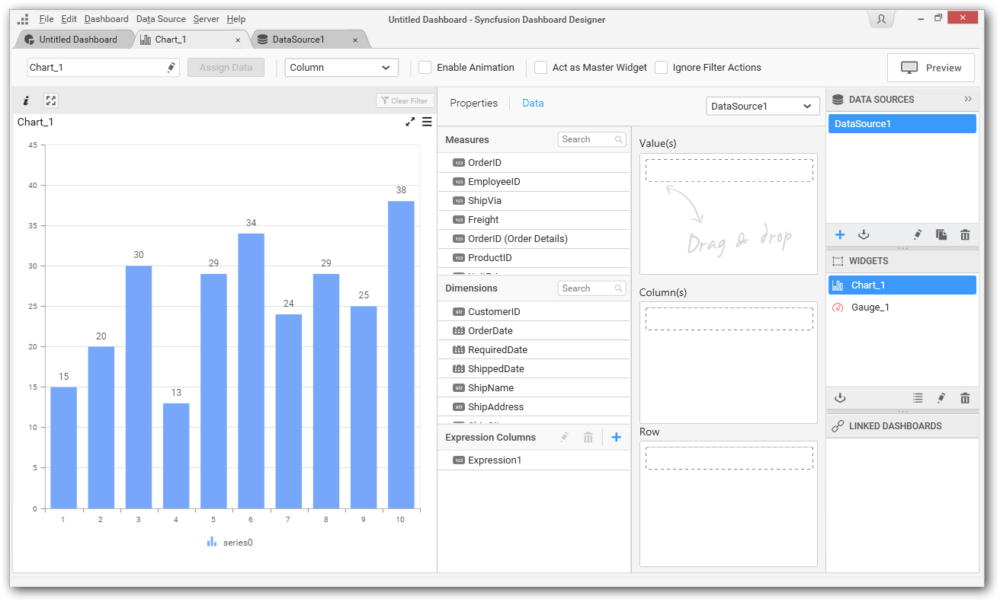

Here, the left pane holds the widget preview. This preview will reflect the configuration changes made to that widget for your reference.

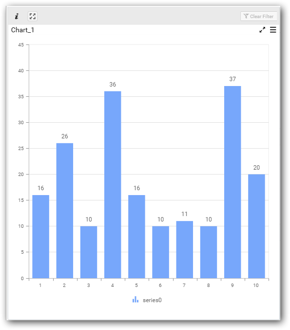

Right pane holds data configuration view. The numeric columns will get listed under the `Measures` section; other type columns get listed under the `Dimensions` section; the expression columns created dynamically, get listed under `Expression Columns` section.

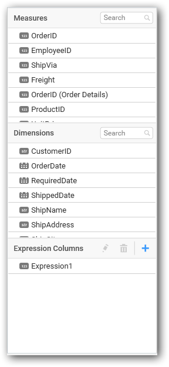

Select and drag the numeric column (measure element) from the `Measures` section or the expression column (from `Expression Columns` section) that you prefer to be measured and drop into the `Value(s)` section. 

Now the widget preview will look like below.

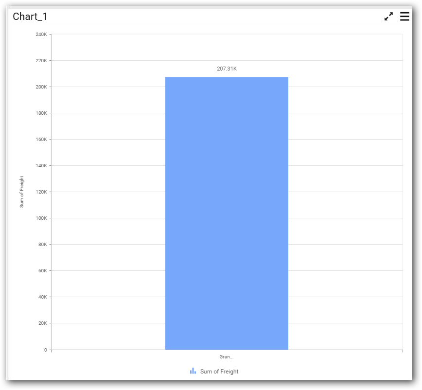

Click the `Settings` icon (highlighted) to open the [aggregation type](/dashboard-platform/dashboard-designer/compose-dashboard/aggregating-value-columns-based-on-type) dropdown list.

Set the aggregation type you prefer by which the measure column that you dropped, should get computed.

Select and drag the non-numeric column (dimension element) from the `Dimensions` section against which you need to measure the numeric column(s) dropped, and drop into the `Column(s)` section.  

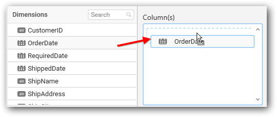

Now the widget preview will look like below.

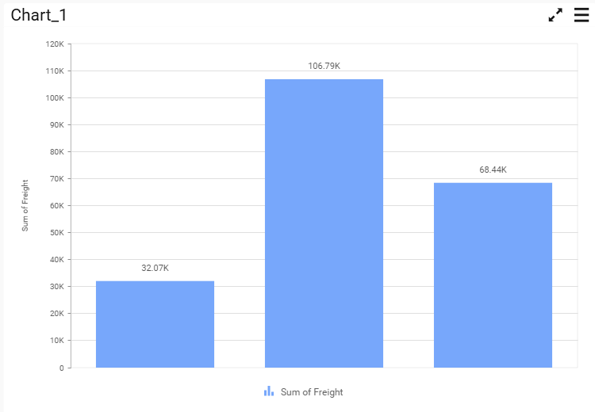

To group the added column element by a column, add the respective non-numeric column (dimension element) into Row(s) section.

Now the widget preview will look like below.

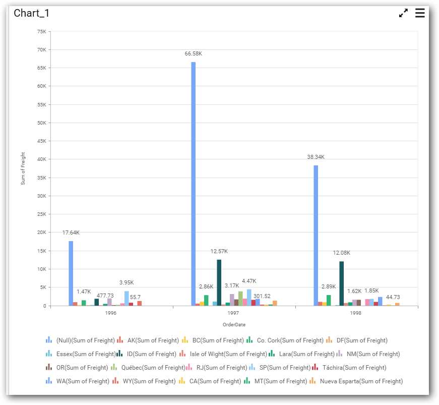

To format the measure column values, if required, click the `Settings` icon (highlighted) to open the dropdown list and click the `Filter` option to open the `Measure Formatting` dialog.

Now the `Measure Formatting` dialog will open like below.

Make necessary changes and click `OK` to save changes you made since opening this dialog; Click `Cancel` to cancel your unsaved changes and close the dialog.

Apply filtering to the dropped measure type or dimension type column(s), if required through [Measure Filter](/dashboard-platform/dashboard-designer/compose-dashboard/configuring-widget-filters#configuring-filter-for-measure-column) and [Filters](/dashboard-platform/dashboard-designer/compose-dashboard/configuring-widget-filters#configuring-filter-for-dimension-column) dialogs respectively, to filter out the data from getting bounded to widget that doesn’t meet filter criteria, which you define.  

## Configuring Properties to Widget

N> This step is applicable only for the widgets other than miscellaneous category.

Navigate to the Properties pane in the data design view tab.

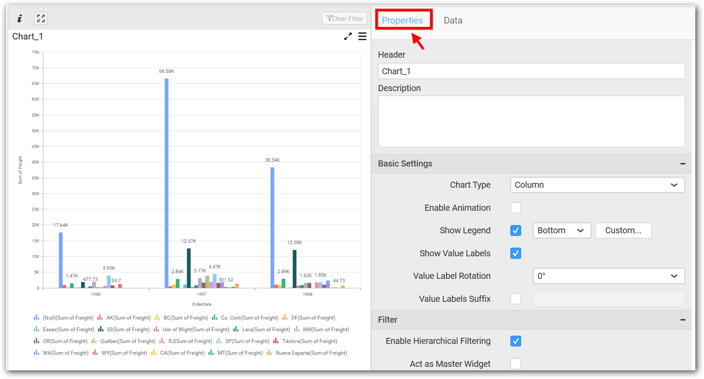

If you are at the dashboard design tab, to navigate to this pane, place the focus in the widget like below.

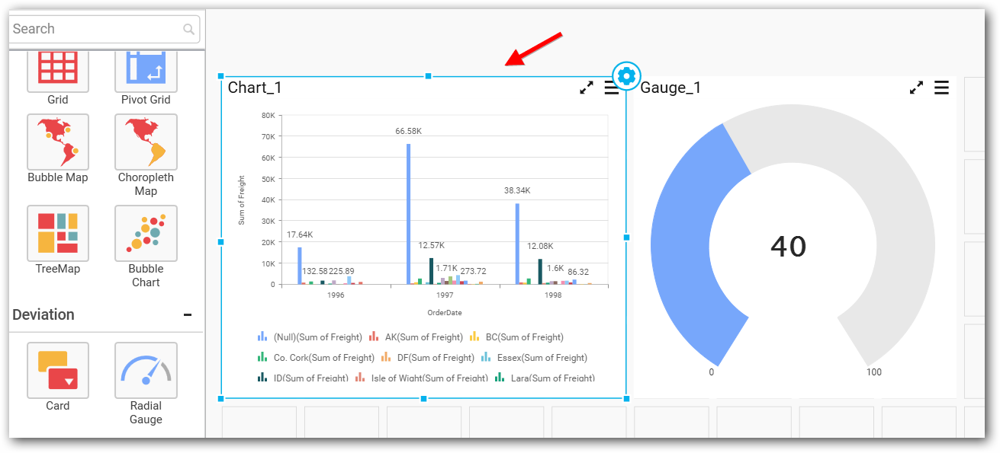

Click the `Settings` icon at top right corner of the widget. Now, focus will move to the data design view tab and opens the `Properties` pane.

This pane holds some general settings and some specific to the widget. Configure your desired settings. Refer [Properties Configuration](/dashboard-platform/dashboard-designer/compose-dashboard/configuring-and-formatting-dashboard-widgets) widget-wise for more details.

Add more widgets that you require following the same procedure.

Once you are done with the dashboard, [save](/dashboard-platform/dashboard-designer/compose-dashboard/saving-a-dashboard) the dashboard in local as SYDX formatted file.

Click Preview at tools pane at top right to see the dashboard preview launched in web browser page.

Now, the dashboard preview can be visualized through the built-in dashboard viewer in web browser page something like below:

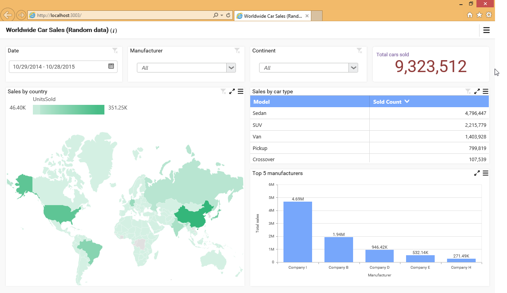

## Sharing Dashboard

[Publish](/dashboard-platform/dashboard-designer/sharing-dashboard) the created dashboard to dashboard server through authorized publish access from Dashboard Designer.

